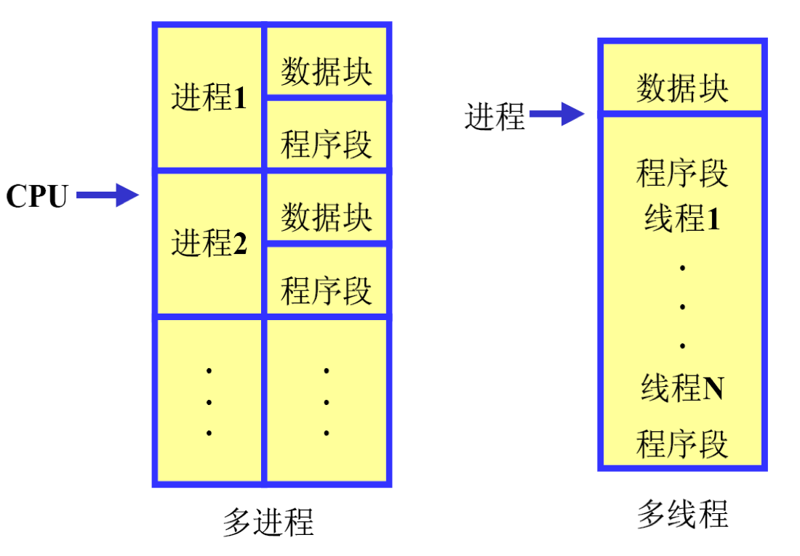
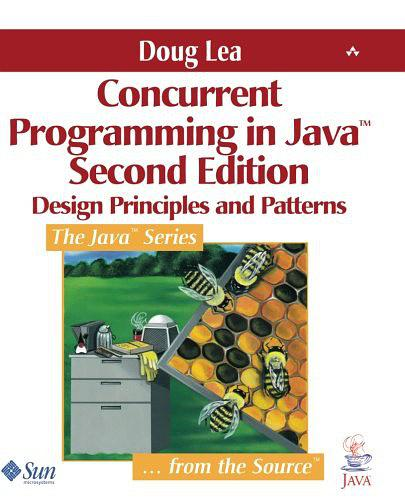
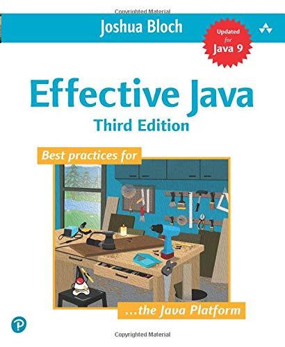

## 并发编程

<small>The world is concurrent.</small>

<small>https://docs.oracle.com/javase/tutorial/essential/concurrency/index.html</small>

🚺

---

"空间是并存事物的次序，或是同时发生的所有事物存在的次序"

-- Leibniz <!-- .element align="right" -->


---

"Concurrency occurs when two or more execution flows are able to run simultaneously." 

-- Edsger Wybe Dijkstra <!-- .element align="right" -->


---

## 概念篇

---

## 进程 vs. 线程

- 进程：是系统进行资源分配和调度的一个独立单位，也是一个具有独立功能的程序；
- 线程：线程依托于进程而存在，是CPU调度和分派的基本单位，它是比进程更小的能独立运行的基本单位。线程自己基本上不拥有系统资源，只拥有一点在运行中必不可少的资源(如程序计数器、一组寄存器和栈)，但是它可与同属一个进程的其他的线程共享进程所拥有的全部资源。

---

## 进程 vs. 线程

<!-- .element height="50%" -->


<span style="color:#0099ff"><small>区别在于，进程属于资源分配的单位，而线程则是作业调度的单位；进程拥有自己的地址空间，而多个线程拥有自己的堆栈和局部变量，并共享所依托于进程的资源。</small></span><!-- .element: class="fragment" -->

---

## 多线程的意义

- 多进程操作的意义在于多个进程轮流共享CPU的时间片(针对单处理器情形，多处理器可理解为并行)，属于并发操作。
- 多线程的并发操作优势在于当程序遇到阻塞的情形。当程序的某个任务因外部条件问题，导致阻塞，如果没有并发，则整个程序停止，直到外部条件发生变化，使用并发后，程序中的其他任务还可以继续执行，如果没有阻塞，在单处理器上考虑多线程并发也就没有意义了，线程之间的切换会造成大量的时间消耗。


---

## 并发 vs 并行

<!-- .element height="50%" -->


---


## JVM Threads

<!-- .element height="50%" -->


---

## 基础篇

---

"Concurrent Programming in Java™: Design Principles and Patterns"

<!-- .element height="50%" -->


---

## Java 并发机制

- 内置并发机制：对线程的直接支持

- 并发对象模型：不纯粹的Active Object模型
  + 同时存在 “主动”对象 和 “被动”对象

- Java 1.5+ java.util.concurrent.*
---

## 接触过多线程程序了吗？


```java

import java.io.*;
import java.net.*;
import java.util.*;

public class QuoteServerThread extends Thread {

    protected DatagramSocket socket = null;
    protected BufferedReader in = null;
    protected boolean moreQuotes = true;

    public QuoteServerThread() throws IOException {
	      this("QuoteServerThread");
    }

    public QuoteServerThread(String name) throws IOException {
        super(name);
        socket = new DatagramSocket(4445);

        try {
            in = new BufferedReader(new FileReader("one-liners.txt"));
        } catch (FileNotFoundException e) {
            System.err.println("Could not open quote file. Serving time instead.");
        }
    }

    public void run() {

        while (moreQuotes) {
            try {
                byte[] buf = new byte[256];

                // receive request
                DatagramPacket packet = new DatagramPacket(buf, buf.length);
                socket.receive(packet);

                // figure out response
                String dString = null;
                if (in == null)
                    dString = new Date().toString();
                else
                    dString = getNextQuote();

                buf = dString.getBytes();

		// send the response to the client at "address" and "port"
                InetAddress address = packet.getAddress();
                int port = packet.getPort();
                packet = new DatagramPacket(buf, buf.length, address, port);
                socket.send(packet);
            } catch (IOException e) {
                e.printStackTrace();
		moreQuotes = false;
            }
        }
        socket.close();
    }

    protected String getNextQuote() {
        String returnValue = null;
        try {
            if ((returnValue = in.readLine()) == null) {
                in.close();
		moreQuotes = false;
                returnValue = "No more quotes. Goodbye.";
            }
        } catch (IOException e) {
            returnValue = "IOException occurred in server.";
        }
        return returnValue;
    }
}

```

---

## 接触过多线程程序了吗？

```java

import java.io.*;

public class QuoteServer {
    public static void main(String[] args) throws IOException {
        new QuoteServerThread().start();
    }
}

```

---

## 创建线程

- 实现Runnable接口
- 继承Thread

---

## Runnable


java.lang.Runnable

``` java
public interface Runnable {
    public abstract void run();
}

public class LiftOff implements Runnable {
    protected int countDown = 10; // Default
    private static int taskCount = 0;
    private final int id = taskCount++;

    public LiftOff() {
    }

    public LiftOff(int countDown) {
        this.countDown = countDown;
    }

    public String status() {
        return "#" + id + "(" +
                (countDown > 0 ? countDown : "Liftoff!") + "), ";
    }

    public void run() {
        while (countDown-- > 0) {
            System.out.print(status());
            Thread.yield(); //后面解释
        }
    }
}

public class MainThread {
    public static void main(String[] args) {
        LiftOff launch = new LiftOff();
        launch.run(); //is it a thread?
    }
}
```

<small>`Runnable`接口仅仅定义“任务”</small>

---

## Thread

java.lang.Thread

``` java
public class BasicThreads {
    public static void main(String[] args) {
        //把任务装进线程里
        Thread t = new Thread(new LiftOff());
        t.start();
        System.out.println("Waiting for LiftOff");
    }
}
```

<small>`Thread`对象像是运载火箭，`Runnable`的实现对象就是一个荷载（payload）</small>

---

## 或者

``` java
public class SimpleThread extends Thread {
    private int countDown = 5;
    private static int threadCount = 0;

    public SimpleThread() {
        // Store the thread name:
        super(Integer.toString(++threadCount));
        start();
    }

    public String toString() {
        return "#" + getName() + "(" + countDown + "), ";
    }

    public void run() {
        while (true) {
            System.out.print(this);
            if (--countDown == 0)
                return;
        }
    }

    public static void main(String[] args) {
        for (int i = 0; i < 5; i++)
            new SimpleThread();
    }
}
```

<small>实际上</small>

<small>`public class Thread implements Runnable`</small>

---

## WARNING

- The run() method should not be called directly by the application. The system calls it.

- If the run() method is called explicitly by the application then the code is executed sequentially not concurrently.

---

## 多线程，走起

```java
public class MoreBasicThreads {
    public static void main(String[] args) {
        for (int i = 0; i < 5; i++)
            new Thread(new LiftOff()).start();
        System.out.println("Waiting for LiftOff");
    }
}
```

直接启动多个`Thread`


---

## 或者用ExecutorService启动

``` java
public class CachedThreadPool {
    public static void main(String[] args) {
        ExecutorService exec = Executors.newCachedThreadPool();
        for (int i = 0; i < 5; i++)
            exec.execute(new LiftOff());
        exec.shutdown();
    }
}
```
<small>`CachedThreadPool`：根据需要创建新线程的线程池，如果现有线程没有可用的，则创建一个新线程并添加到池中，如果有被使用完但是还没销毁的线程，就复用该线程</small>

---

## 线程池？

- 在面向对象编程中，创建和销毁对象是很费时间的，因为创建一个对象要获取内存资源或者其它更多资源。
- 在Java中更是如此，虚拟机将试图跟踪每一个对象，以便能够在对象销毁后进行垃圾回收。
- 所以提高服务程序效率的一个手段就是尽可能减少创建和销毁对象的次数，特别是一些很耗资源的对象创建和销毁。
- 如何利用已有对象来服务就是一个需要解决的关键问题，其实这就是一些"池化资源"技术产生的原因。

---

## 或者另一种策略

``` java
public class FixedThreadPool {
    public static void main(String[] args) {
        // Constructor argument is number of threads:
        ExecutorService exec = Executors.newFixedThreadPool(5);
        for (int i = 0; i < 5; i++)
            exec.execute(new LiftOff());
        exec.shutdown();
    }
}
```
<small>创建一个固定线程数的线程池，在任何时候最多只有n个线程被创建。如果在所有线程都处于活动状态时，有其他任务提交，他们将等待队列中直到线程可用。如果任何线程由于执行过程中的故障而终止，将会有一个新线程取代这个线程执行后续任务。</small>

<small>如果需要获得异步执行的任务结果怎么办？</small><!-- .element: class="fragment" -->


---

## Callable

``` java

public interface Callable<V> {
    V call() throws Exception;
}

class TaskWithResult implements Callable<String> {
    private int id;

    public TaskWithResult(int id) {
        this.id = id;
    }

    public String call() {
        return "result of TaskWithResult " + id;
    }
}

public class CallableDemo {
    public static void main(String[] args) {
        ExecutorService exec = Executors.newCachedThreadPool();
        ArrayList<Future<String>> results =
                new ArrayList<Future<String>>();
        for (int i = 0; i < 10; i++)
            results.add(exec.submit(new TaskWithResult(i)));
        for (Future<String> fs : results)
            try {
                // get() blocks until completion:
                System.out.println(fs.get());
            } catch (InterruptedException e) {
                System.out.println(e);
                return;
            } catch (ExecutionException e) {
                System.out.println(e);
            } finally {
                exec.shutdown();
            }
    }
}
```


---

## Future

``` java
class MyCallable implements Callable<String>{
    @Override
    public String call() throws Exception {
        System.out.println("做一些耗时的任务...");
        Thread.sleep(5000);
        return "OK";
    }
}

public class FutureSimpleDemo {
    public static void main(String[] args) throws InterruptedException, ExecutionException {

        ExecutorService executorService = Executors.newCachedThreadPool();
        Future<String> future = executorService.submit(new MyCallable());

        System.out.println("dosomething...");

        System.out.println("得到异步任务返回结果：" + future.get());
        System.out.println("Completed!");
    }
}
```

<small>当调用`Future`的`get()`方法以获得结果时，当前线程就开始阻塞，直接`call()`方法结束返回结果。</small>

---

## SLEEP 

- suspend execution for a specified period

``` java
public class SleepingTask extends LiftOff {
    public void run() {
        try {
            while (countDown-- > 0) {
                System.out.print(status());
                // Old-style:
                // Thread.sleep(100);
                // Java SE5/6-style:
                TimeUnit.MILLISECONDS.sleep(100);
            }
        } catch (InterruptedException e) {
            //可能被打断
            System.err.println("Interrupted");
        }
    }

    public static void main(String[] args) {
        ExecutorService exec = Executors.newCachedThreadPool();
        for (int i = 0; i < 5; i++)
            exec.execute(new SleepingTask());
        exec.shutdown();
    }
}
```

<small>运行结果看起来很均衡，但实际并不完全如此...跟`yeild()`语义不一样</small> <!-- .element: class="fragment" -->


---

## Yeild 让位 

- `yield`和`sleep`的主要区别：
  + <small>yield方法会临时暂停当前正在执行的线程，来让有同样优先级的正在等待的线程有机会执行</small>
  + <small>如果没有正在等待的线程，或者所有正在等待的线程的优先级都比较低，那么该线程会继续运行</small>
  + <small>执行了yield方法的线程什么时候会继续运行由线程调度器来决定，不同的厂商可能有不同的行为</small>
  + <small>yield方法不保证当前的线程会暂停或者停止，但是可以保证当前线程在调用yield方法时会放弃CPU</small>


---

## Priority

``` java
public class SimplePriorities implements Runnable {
    private int countDown = 5;
    private volatile double d; // No optimization 后面再解释
    private int priority;

    public SimplePriorities(int priority) {
        this.priority = priority;
    }

    public String toString() {
        return Thread.currentThread() + ": " + countDown;
    }

    public void run() {
        Thread.currentThread().setPriority(priority);
        while (true) {
            // An expensive, interruptable operation:
            for (int i = 1; i < 100000; i++) {
                d += (Math.PI + Math.E) / (double) i;
                if (i % 1000 == 0)
                    Thread.yield();
            }
            System.out.println(this);
            if (--countDown == 0) return;
        }
    }

    public static void main(String[] args) {
        ExecutorService exec = Executors.newCachedThreadPool();
        for (int i = 0; i < 5; i++)
            exec.execute(
                    new SimplePriorities(Thread.MIN_PRIORITY));
        exec.execute(
                new SimplePriorities(Thread.MAX_PRIORITY));
        exec.shutdown();
    }
}
```

改变线程优先级这件事可以做，但尽量不要做<!-- .element: class="fragment" -->

---


## Daemon 线程

``` java
public class SimpleDaemons implements Runnable {
    public void run() {
        try {
            while (true) {
                TimeUnit.MILLISECONDS.sleep(100);
                print(Thread.currentThread() + " " + this);
            }
        } catch (InterruptedException e) {
            print("sleep() interrupted");
        }
    }

    public static void main(String[] args) throws Exception {
        for (int i = 0; i < 10; i++) {
            Thread daemon = new Thread(new SimpleDaemons());
            daemon.setDaemon(true); // Must call before start()
            daemon.start();
        }
        print("All daemons started");
        TimeUnit.MILLISECONDS.sleep(99);
    }
}
```

后台运行线程，当所有非后台线程结束时，应用退出，所有Daemon线程被杀😢

---

## Thread Identification

- The identity of the currently running thread can be found using the <font color="red">currentThread</font> method.
- This has a static modifier, which means that there is only one method for all instances of Thread objects.
- The method can always be called using the <font color="red">Thread</font> class.
  +  public static Thread currentThread();


---

## 线程是否结束？

-  final boolean isAlive()  //很少用到
-  final void join() throws InterruptedException  //等待所调用线程结束

---

## Join

``` java
class Sleeper extends Thread {
    private int duration;

    public Sleeper(String name, int sleepTime) {
        super(name);
        duration = sleepTime;
        start();
    }

    public void run() {
        try {
            sleep(duration);
        } catch (InterruptedException e) {
            print(getName() + " was interrupted. " +
                    "isInterrupted(): " + isInterrupted());
            return;
        }
        print(getName() + " has awakened");
    }
}

class Joiner extends Thread {
    private Sleeper sleeper;

    public Joiner(String name, Sleeper sleeper) {
        super(name);
        this.sleeper = sleeper;
        start();
    }

    public void run() {
        try {
            sleeper.join();
        } catch (InterruptedException e) {
            print("Interrupted");
        }
        print(getName() + " join completed");
    }
}

public class Joining {
    public static void main(String[] args) {
        Sleeper
                sleepy = new Sleeper("Sleepy", 1500),
                grumpy = new Sleeper("Grumpy", 1500);
        Joiner
                dopey = new Joiner("Dopey", sleepy),
                doc = new Joiner("Doc", grumpy);
        grumpy.interrupt();
    }
}
```

---

## 线程生命周期

<!-- .element height="50%" -->


---

## 小结一下

Java关于线程编程的抽象


`Thread`对象像是运载火箭，`Runnable`的实现对象就是一个荷载（payload）


Runnable/Callable --> Task <!-- .element: class="fragment" -->

Thread --> let tasks go <!-- .element: class="fragment" -->

---

## 中级篇

---

## 资源共享问题

一个葫芦娃在战场上可以随意走，多个葫芦娃在战场上是随意走，那就会撞头。

因为一个空间位置，是不能共享的。

---

## View of OO System

- System = objects + activities

---

## Object-centric view

- A system is a collection of interconnected objects. But it is a structured collection, not a random object soup. Objects cluster together in groups, thus forming larger components and subsystems.

---

## Activity-centric view

- A system is a collection of possibly concurrent activities. 
- One logical activity may involve many threads. At a higher level, some of these activities represent system-wide use cases. 


---

## Correctness

- Safety (object-centric):
  + “Nothing bad ever happens to an object.”
  + Safety failure lead to unintended behavior at run time — things just start going wrong. 
- Liveness (activity-centric): 
  + “Something eventually happens within an activity.”
  + Liveness failures lead to no behavior — things just stop running. 


---

## Liveness

- In live systems, every activity eventually progresses toward completion; every invoked method eventually executes. 


---

## Liveness Failures

- Deadlock: Circular dependencies among locks

- Livelock: A continuously retried action continuously fails.

- Starvation: The JVM/OS fails ever to allocate CPU time to a thread. 

- ...


---

## Strategies

- Immutability

- Synchronization

- Confinement

---

## 回忆一下单例模式

```java
public class LazySingleton {
	private static LazySingleton instance = null;
	protected LazySingleton(){
		System.out.println("Singleton's consturct method is invoked. " +
				"This method should not be public");
	}
	//is it thread-safe? how to?
	public static LazySingleton getInstance(){
		if (instance == null){
			instance = new LazySingleton();
		}
		return instance;
	}
	public void operation(){
		System.out.println("LazySignleton.operation() is executed");
	}
}
```

---

## 示例

EvenGenerator

``` java
public abstract class IntGenerator {
    private volatile boolean canceled = false;

    public abstract int next();

    // Allow this to be canceled:
    public void cancel() {
        canceled = true;
    }

    public boolean isCanceled() {
        return canceled;
    }
}

public class EvenGenerator extends IntGenerator {
    private int currentEvenValue = 0;

    public int next() {
        ++currentEvenValue; // Danger point here!
        ++currentEvenValue;
        return currentEvenValue;
    }
}
```

---

EvenChecker

``` java

public class EvenChecker implements Runnable {
    private IntGenerator generator;
    private final int id;

    public EvenChecker(IntGenerator g, int ident) {
        generator = g;
        id = ident;
    }

    public void run() {
        while (!generator.isCanceled()) {
            int val = generator.next();
            if (val % 2 != 0) {
                System.out.println(val + " not even!");
                generator.cancel(); // Cancels all EvenCheckers
            }
        }
    }

    // Test any type of IntGenerator:
    public static void test(IntGenerator gp, int count) {
        System.out.println("Press Control-C to exit");
        ExecutorService exec = Executors.newCachedThreadPool();
        for (int i = 0; i < count; i++)
            exec.execute(new EvenChecker(gp, i));
        exec.shutdown();
    }

    // Default value for count:
    public static void test(IntGenerator gp) {
        test(gp, 10);
    }

    public static void main(String[] args) {
        EvenChecker.test(new EvenGenerator());
    }

}

```

---

## 解决方法

对资源加锁，使得对资源的访问顺序化，确保在某一时刻只有一个任务在使用共享资源（使其互斥）

Mutual Exclusion （Mutex）


---

## Synchronized

``` java
public class Synchronized EvenGenerator extends IntGenerator {
    private int currentEvenValue = 0;

    public synchronized int next() {
        ++currentEvenValue;
        Thread.yield(); 
        ++currentEvenValue;
        return currentEvenValue;
    }

    public static void main(String[] args) {
        EvenChecker.test(new SynchronizedEvenGenerator());
    }
}
```

---

## Lock

``` java

public class MutexEvenGenerator extends IntGenerator {
    private int currentEvenValue = 0;
    private Lock lock = new ReentrantLock();

    public int next() {
        //加锁
        lock.lock();
        try {
            ++currentEvenValue;
            Thread.yield();
            ++currentEvenValue;
            return currentEvenValue;
        } finally {
            //一定要用try-catch的finally去释放锁
            lock.unlock();
        }
    }

    public static void main(String[] args) {
        EvenChecker.test(new MutexEvenGenerator());
    }
} 
```

<small>`ReentrantLock`允许你尝试加锁</small>

<small>`lock.tryLock(2, TimeUnit.SECONDS)`</small>

<small>如果失败做其他处理</small>


---

## Critical Sections 临界区

```java
synchronized(syncObject){
    //balabala
}
```

加锁代码片段


---

## 示例

``` java

// Synchronize the entire method:
class PairManager1 extends PairManager {
    public synchronized void increment() {
        p.incrementX();
        p.incrementY();
        store(getPair());
    }
}

// Use a critical section:
class PairManager2 extends PairManager {
    public void increment() {
        Pair temp;
        synchronized (this) {
            p.incrementX();
            p.incrementY();
            temp = getPair();
        }
        store(temp);
    }
}
```

---

## Thread local Storage

<!-- .element height="50%" -->


--- 

## 示例

``` java
class Accessor implements Runnable {
    private final int id;

    public Accessor(int idn) {
        id = idn;
    }

    public void run() {
        while (!Thread.currentThread().isInterrupted()) {
            ThreadLocalVariableHolder.increment();
            System.out.println(this);
            Thread.yield();
        }
    }

    public String toString() {
        return "#" + id + ": " +
                ThreadLocalVariableHolder.get();
    }
}

public class ThreadLocalVariableHolder {
    private static ThreadLocal<Integer> value =
            new ThreadLocal<Integer>() {
                private Random rand = new Random(47);

                protected synchronized Integer initialValue() {
                    return rand.nextInt(10000);
                }
            };

    public static void increment() {
        value.set(value.get() + 1);
    }

    public static int get() {
        return value.get();
    }

    public static void main(String[] args) throws Exception {
        ExecutorService exec = Executors.newCachedThreadPool();
        for (int i = 0; i < 5; i++)
            exec.execute(new Accessor(i));
        TimeUnit.SECONDS.sleep(3);  // Run for a while
        exec.shutdownNow();         // All Accessors will quit
    }
}
```

---

## 从竞争到协作

```java
wait();
notify();
notifyAll();
```

`Object`类型上的三个方法

---

## Java Concurrency Models

- wait: an unconditional suspension of the calling thread (the thread is placed on a queue associated with the condition variable)
- notify: one thread is taken from the queue and re-scheduled for execution (it must reclaim the lock first)
- notifyAll: all suspended threads are re-scheduled
- notify and notifyAll have no effect if no threads are suspended on the condition variable


---

## 还是看个例子

```java
class Car {
    private boolean waxOn = false;

    public synchronized void waxed() {
        waxOn = true; // Ready to buff
        notifyAll();
    }

    public synchronized void buffed() {
        waxOn = false; // Ready for another coat of wax
        notifyAll();
    }

    public synchronized void waitForWaxing()
            throws InterruptedException {
        while (waxOn == false)
            wait();
    }

    public synchronized void waitForBuffing()
            throws InterruptedException {
        while (waxOn == true)
            wait();
    }
}

class WaxOn implements Runnable {
    private Car car;

    public WaxOn(Car c) {
        car = c;
    }

    public void run() {
        try {
            while (!Thread.interrupted()) {
                printnb("Wax On! ");
                TimeUnit.MILLISECONDS.sleep(200);
                car.waxed();
                car.waitForBuffing();
            }
        } catch (InterruptedException e) {
            print("Exiting via interrupt");
        }
        print("Ending Wax On task");
    }
}

class WaxOff implements Runnable {
    private Car car;

    public WaxOff(Car c) {
        car = c;
    }

    public void run() {
        try {
            while (!Thread.interrupted()) {
                car.waitForWaxing();
                printnb("Wax Off! ");
                TimeUnit.MILLISECONDS.sleep(200);
                car.buffed();
            }
        } catch (InterruptedException e) {
            print("Exiting via interrupt");
        }
        print("Ending Wax Off task");
    }
}

public class WaxOMatic {
    public static void main(String[] args) throws Exception {
        Car car = new Car();
        ExecutorService exec = Executors.newCachedThreadPool();
        exec.execute(new WaxOff(car));
        exec.execute(new WaxOn(car));
        TimeUnit.SECONDS.sleep(5); // Run for a while...
        exec.shutdownNow(); // Interrupt all tasks
    }
}
```

---

## 再看一下线程状态

<!-- .element height="50%" -->

---

## wait和sleep的区别

- 调用wait方法时，线程在等待的时候会释放掉它所获得的monitor，但是调用Thread.sleep()方法时，线程在等待的时候仍然会持有monitor或者锁，wait方法应在同步代码块中调用，但是sleep方法不需要
- Thread.sleep()方法是一个静态方法，作用在当前线程上；但是wait方法是一个实例方法，并且只能在其他线程调用本实例的notify()方法时被唤醒
- 如果需要暂停线程一段特定的时间就使用sleep()方法，如果要实现线程间通信就使用wait()方法。

---


## 高级篇

---

## 高级设施 

java.util.concurrent.*

- `CountDownLatch`
- `CyclicBarrier`
- `DelayQueue`
- `PriorityBlockingQueue`
- `ScheduledExecutorService`
- `Semaphore`
- `Exchanger`

---

## 推荐

<!-- .element height="50%" -->


---

让你的葫芦娃们抖动起来！


---

# END